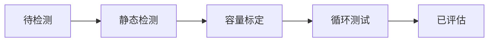
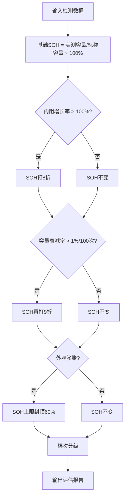

## 1. 产品概述

电池回收企业退役电池全流程检测与梯次利用决策管理系统，实现从电池入厂检测到梯次利用分级的全流程数字化管理，提升检测效率和决策准确性。

- 核心目标：通过数字化手段管理退役电池检测全流程，自动进行SOH评估和梯次分级
- 目标用户：电池回收企业检测人员、质量管理人员、数据分析人员
- 产品价值：标准化检测流程，自动化评估决策，数据驱动的批次管理

## 2. 核心功能

### 2.1 功能模块

1. **检测流程看板**：Kanban风格展示，拖拽式状态流转，阶段数据录入
2. **电池清单管理**：全量数据展示，多维度筛选排序，批量操作
3. **电池详情**：检测时间线，SOH仪表盘，各阶段参数明细
4. **数据分析仪表盘**：多维度统计图表，数据可视化分析
5. **电池对比**：多电池参数对比，雷达图展示，自动生成对比结论
6. **批次管理**：按到货日期分批次管理，批次整体质量评估
7. **导出功能**：CSV导出、打印报告、图表图片导出

### 2.2 页面详情

| 页面名称 | 模块名称 | 功能描述 |
|----------|----------|----------|
| 检测流程看板 | 五列Kanban | 待检测/静态检测/容量标定/循环测试/已评估五列展示，卡片拖拽流转 |
| 检测流程看板 | 数据录入Modal | 拖拽到新阶段时弹出对应阶段数据录入表单 |
| 检测流程看板 | 数量Badge | 每列顶部显示当前状态电池数量 |
| 电池清单 | 数据表格 | 全量电池信息展示，多列排序，分页（15条/页） |
| 电池清单 | 搜索筛选 | 编码/车型模糊搜索，状态/分级/SOH范围/日期范围高级筛选 |
| 电池清单 | 批量操作 | 多选批量调整分级、批量导出CSV |
| 电池详情 | 基本信息卡片 | 电池编码、车型、标称参数等基础信息展示 |
| 电池详情 | 检测时间线 | 各检测阶段的时间和结果时间线展示 |
| 电池详情 | SOH仪表盘 | 圆弧进度条展示SOH值，分段颜色指示 |
| 电池详情 | 参数折叠面板 | 各阶段检测参数可展开查看明细 |
| 电池详情 | 评估报告 | 已评估电池展示评估报告详情（参数明细+修正过程+最终结论） |
| 数据分析仪表盘 | 总览卡片 | 总数、各阶段数量、平均SOH、A级占比 |
| 数据分析仪表盘 | 分级饼图 | 各梯次分级数量饼图 |
| 数据分析仪表盘 | 车型分布柱状图 | 各来源车型数量柱状图 |
| 数据分析仪表盘 | SOH分布直方图 | SOH值分布直方图（5段） |
| 数据分析仪表盘 | 内阻vs SOH散点图 | 内阻与SOH相关性散点图 |
| 数据分析仪表盘 | 车型平均SOH对比 | 各车型平均SOH对比柱状图 |
| 数据分析仪表盘 | 月度到货趋势 | 月度到货量趋势折线图 |
| 电池对比 | 对比表格 | 横向参数对比，差异标红 |
| 电池对比 | 雷达图 | 5维归一化雷达图对比 |
| 电池对比 | 对比结论 | 自动生成对比结论文字 |
| 批次管理 | 批次列表 | 按到货日期分组的批次列表 |
| 批次管理 | 批次统计 | 批次数量、已评估数、各分级数量、批次通过率 |
| 全局导航 | Tab导航 | 顶部Tab导航切换各模块 |
| 全局导航 | 主题切换 | 暗色/亮色主题切换，localStorage持久化 |

## 3. 核心流程

### 3.1 电池检测流程

退役电池到货后进入待检测状态，依次经过静态检测、容量标定、循环测试三个检测阶段，最终完成评估分级。每阶段完成后才能进入下一阶段，不可回退。

### 3.2 SOH评估流程

完成循环测试后执行评估，系统根据检测数据自动计算SOH值并进行修正，最终确定梯次分级。

## 4. 用户界面设计

### 4.1 设计风格

- 设计方向：工业科技感 + 专业稳重
- 主色调：深青色（teal）作为主色，体现工业专业感
- 辅助色：绿色（A级）、蓝色（B级）、黄色（C级）、红色（D级）表示分级
- 卡片风格：圆角卡片，微妙阴影，悬停微动效
- 字体：现代无衬线字体，清晰可读
- 布局：顶部导航 + 内容区，响应式适配

### 4.2 页面设计概览

| 页面名称 | 模块名称 | UI元素 |
|----------|----------|--------|
| 检测流程看板 | Kanban列 | 五列等宽布局，卡片堆叠，拖拽时半透明预览 |
| 电池清单 | 数据表格 | 斑马纹行，分级背景色，固定表头可滚动 |
| 电池详情 | SOH仪表盘 | 圆弧进度，分段渐变色，中心显示数值 |
| 数据分析仪表盘 | 图表网格 | 2x3网格布局，图表卡片等大，图例可点击切换 |
| 全局导航 | 顶部Tab | 等宽Tab，选中下划线动画，主题切换按钮在右侧 |

### 4.3 响应式

- 桌面端（>1024px）：完整布局，多列并排
- 平板端（768-1024px）：Kanban两列换行，表格横向滚动
- 移动端（<768px）：单列布局，Tab可滚动，简化信息展示

### 4.4 梯次分级颜色规范

| 分级 | 颜色 | 色值（亮色） | 色值（暗色） |
|------|------|-------------|-------------|
| A级（储能级） | 绿色 | #10b981 | #34d399 |
| B级（低速车级） | 蓝色 | #3b82f6 | #60a5fa |
| C级（备电级） | 黄色 | #f59e0b | #fbbf24 |
| D级（报废） | 红色 | #ef4444 | #f87171 |
| 未评估 | 灰色 | #9ca3af | #6b7280 |
