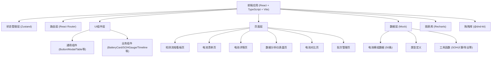

## 1. 架构设计



## 2. 技术描述

- **前端框架**：React 18 + TypeScript 5 + Vite 5
- **样式方案**：Tailwind CSS 3 + CSS变量（主题切换）
- **状态管理**：Zustand
- **路由管理**：React Router DOM 6
- **图表库**：Recharts
- **拖拽库**：@dnd-kit/core + @dnd-kit/sortable
- **图标库**：Lucide React
- **导出工具**：html2canvas（图表导出PNG）
- **数据来源**：前端Mock数据（TypeScript文件导出）
- **构建工具**：Vite

## 3. 路由定义

| 路由 | 页面 | 说明 |
|------|------|------|
| / | 检测流程看板 | 默认首页，Kanban风格展示 |
| /batteries | 电池清单 | 全量电池列表，支持筛选排序 |
| /batteries/:id | 电池详情 | 单个电池的详细信息 |
| /dashboard | 数据分析仪表盘 | 各类统计图表 |
| /compare | 电池对比 | 多电池参数对比 |
| /batches | 批次管理 | 按到货日期分批次管理 |

## 4. 数据模型

### 4.1 电池模组数据模型

```typescript
// 检测状态枚举
type DetectionStatus = 'pending' | 'static_done' | 'capacity_done' | 'cycle_done' | 'evaluated';

// 梯次分级
type Grade = 'A' | 'B' | 'C' | 'D';

// 外观状态
type AppearanceStatus = 'normal' | 'swollen' | 'deformed';

// 来源车型
type CarModel = '比亚迪汉' | '特斯拉Model3' | '蔚来ES6' | '小鹏P7' | '理想L7';

// 静态检测数据
interface StaticTestData {
  openCircuitVoltage: number;  // 开路电压V
  internalResistance: number;  // 内阻mΩ
  appearance: AppearanceStatus;  // 外观状态
  testDate: string;  // 检测日期
}

// 容量标定数据
interface CapacityTestData {
  actualCapacity: number;  // 实测容量Ah
  calibratedSOH: number;  // 标定SOH%
  testDate: string;
}

// 循环测试数据
interface CycleTestData {
  cycleCount: number;  // 测试循环数
  capacityDecayRate: number;  // 容量衰减率%每100次
  resistanceGrowthRate: number;  // 内阻增长率%
  testDate: string;
}

// 评估结果
interface EvaluationResult {
  finalSOH: number;  // 最终SOH%
  grade: Grade;  // 梯次分级
  baseSOH: number;  // 基础SOH
  resistanceDiscount: boolean;  // 内阻修正（打8折）
  decayDiscount: boolean;  // 衰减修正（打9折）
  appearanceCap: boolean;  // 外观封顶（60%）
  evaluateDate: string;
}

// 电池模组
interface BatteryModule {
  id: string;  // 电池编码 BAT2024XXXXX
  carModel: CarModel;  // 来源车型
  nominalCapacity: number;  // 标称容量Ah
  nominalVoltage: number;  // 标称电压V
  manufactureDate: string;  // 出厂日期
  arrivalDate: string;  // 到货日期
  status: DetectionStatus;  // 检测状态
  staticTest?: StaticTestData;  // 静态检测数据
  capacityTest?: CapacityTestData;  // 容量标定数据
  cycleTest?: CycleTestData;  // 循环测试数据
  evaluation?: EvaluationResult;  // 评估结果
}
```

### 4.2 批次数据模型

```typescript
interface BatteryBatch {
  date: string;  // 批次日期（到货日期）
  count: number;  // 总数量
  evaluatedCount: number;  // 已评估数量
  gradeA: number;
  gradeB: number;
  gradeC: number;
  gradeD: number;
  passRate: number;  // A+B占比
}
```

## 5. 项目结构

```
src/
├── components/          # 通用组件
│   ├── ui/             # 基础UI组件（Button/Modal/Input等）
│   ├── BatteryCard.tsx # 电池卡片
│   ├── SOHGauge.tsx    # SOH仪表盘
│   ├── Timeline.tsx    # 检测时间线
│   └── ...
├── pages/              # 页面组件
│   ├── KanbanBoard.tsx    # 检测流程看板
│   ├── BatteryList.tsx    # 电池清单
│   ├── BatteryDetail.tsx  # 电池详情
│   ├── Dashboard.tsx      # 数据分析仪表盘
│   ├── Compare.tsx        # 电池对比
│   └── BatchManage.tsx    # 批次管理
├── store/              # 状态管理
│   └── batteryStore.ts # 电池数据store
├── data/               # Mock数据
│   ├── mockBatteries.ts # 50条电池数据
│   └── types.ts         # 类型定义
├── utils/              # 工具函数
│   ├── sohCalculator.ts # SOH评估算法
│   ├── exportUtils.ts   # 导出工具函数
│   └── formatters.ts    # 格式化函数
├── hooks/              # 自定义hooks
│   └── useTheme.ts      # 主题切换hook
├── App.tsx             # 应用入口
├── main.tsx            # 渲染入口
└── index.css           # 全局样式（含Tailwind和CSS变量）
```

## 6. 核心算法

### 6.1 SOH评估算法

```
1. 基础SOH = 实测容量 / 标称容量 × 100%
2. 内阻增长率 > 100% → SOH = SOH × 0.8
3. 容量衰减率 > 1%/100次 → SOH = SOH × 0.9
4. 外观膨胀 → SOH = min(SOH, 60)
5. 分级：
   - SOH ≥ 80% → A级（储能级）
   - 60% ≤ SOH < 80% → B级（低速车级）
   - 40% ≤ SOH < 60% → C级（备电级）
   - SOH < 40% → D级（报废）
```

### 6.2 拖拽校验规则

- 只能从当前列拖拽到相邻下一列
- 状态流转顺序：待检测 → 静态检测完成 → 容量标定完成 → 循环测试完成 → 已评估
- 不允许回退或跳级

## 7. 主题系统

- 使用 CSS 变量定义主题色
- 通过 data-theme 属性切换
- 主题偏好存储在 localStorage
- 支持亮色/暗色两种主题
```
